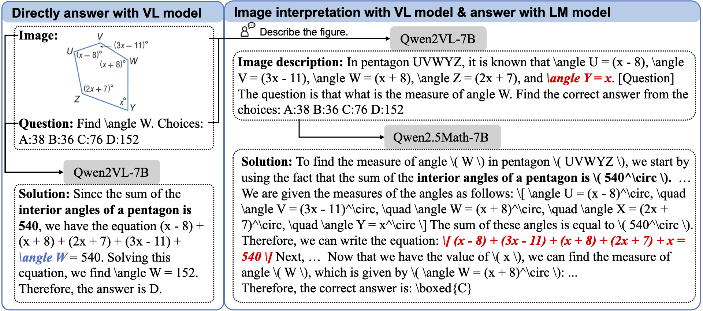

## Introduction

This repo implements "Integrating Visual Interpretation and Linguistic Reasoning for Math Problem Solving.

[[arxiv]([https://arxiv.org/abs/2211.12739](https://arxiv.org/abs/2505.17609))] [[ICCV2025]()]


<p align="center">
 
</p>

Current large vision-language models (LVLMs) typically employ end-to-end training to achieve multi-modal understanding in a unified process. Effective alignment needs high-quality pre-training data and a carefully designed training process. Current LVLMs face challenges when addressing complex vision-language reasoning tasks, with their reasoning capabilities notably lagging behind those of LLMs. We proposes a paradigm shift: instead of training end-to-end vision-language reasoning models, we advocate for developing a decoupled reasoning framework based on existing visual interpretation specialists and text-based reasoning LLMs. Our approach leverages (1) a dedicated vision-language model to transform the visual content of images into textual descriptions and (2) an LLM to perform reasoning according to the visual-derived text and the original question. This method presents a cost-efficient solution for multi-modal model development by optimizing existing models to work collaboratively, avoiding end-to-end development of vision-language models from scratch. By transforming images into language model-compatible text representations, it facilitates future low-cost and flexible upgrades to upcoming powerful LLMs.


## Environment

``` bash
conda create -n dvlr python=3.10
conda activate dvlr
pip install -r requirements.txt
```


## Usage

Benchmarking vision-language model with decoupled reasoning:

``` bash
cd ./eval/MathVerse/evaluation

# generate image interpretations for the testset images
python vcg_geo_qwenvl_2.py --output_dir ../data --output_file testmini_caption_qwenvl_2_7B.json --checkpoint "Qwen/Qwen2-VL-7B-Instruct" --input_file "testmini.json" --query_format "question"

# generate response with interpretations
python generate_response_geo_text_qwen_2.py --output_dir ../results --output_file output_qwenmath_2_5_7B__caption_qwenvl_2_7B.json --checkpoint "Qwen/Qwen2.5-Math-7B-Instruct" --input_file "testmini_caption_qwenvl_2_7B.json" --query_format "question_summary" --use_familiar_hint

# extract answer
python extract_answer.py --output_dir ../results --output_file output_qwenmath_2_5_7B__caption_qwenvl_2_7B.json --output_label extracted --rerun

# calculate score
python calculate_score.py --output_dir ../results --output_file output_qwenmath_2_5_7B__caption_qwenvl_2_7B_extracted.json --score_file scores_output_qwenmath_2_5_7B__caption_qwenvl_2_7B_extracted.json
```

## Acknowledgement
This repository borrows code from [R-CoT](https://github.com/dle666/R-CoT). Thanks for their contributions!

