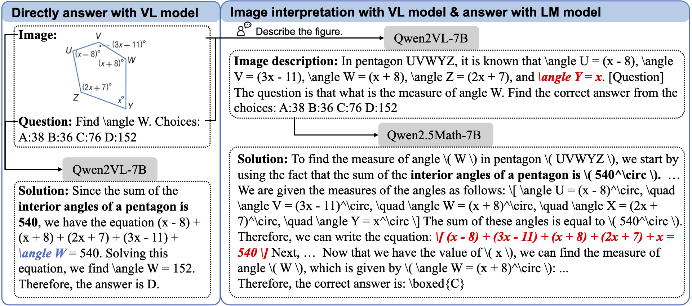

# DVLR
Implementation of "Integrating Visual Interpretation and Linguistic Reasoning for Geometric Problem Solving".

<p align="center">
 
</p>


### 1. Environment

``` bash
conda create -n dvlr python=3.10
conda activate dvlr
pip install -r requirements.txt
```


### 2. Usage

Benchmarking vision-language model with decoupled reasoning:

``` bash
cd ./eval/MathVerse/evaluation

# generate image interpretations for the testset images
python vcg_geo_qwenvl_2.py --output_dir ../data --output_file testmini_caption_qwenvl_2_7B.json --checkpoint "Qwen/Qwen2-VL-7B-Instruct" --input_file "testmini.json" --query_format "question"

# generate response with interpretations
python generate_response_geo_text_qwen_2.py --output_dir ../results --output_file output_qwenmath_2_5_7B__caption_qwenvl_2_7B.json --checkpoint "Qwen/Qwen2.5-Math-7B-Instruct" --input_file "testmini_caption_qwenvl_2_7B.json" --query_format "question_summary" --use_familiar_hint

# extract answer
python extract_answer.py --output_dir ../results --output_file output_qwenmath_2_5_7B__caption_qwenvl_2_7B.json --output_label extracted --rerun

# calculate score
python calculate_score.py --output_dir ../results --output_file output_qwenmath_2_5_7B__caption_qwenvl_2_7B_extracted.json --score_file scores_output_qwenmath_2_5_7B__caption_qwenvl_2_7B_extracted.json
```

## Acknowledgement
This repository borrows code from [R-CoT](https://github.com/dle666/R-CoT). Thanks for their contributions!

